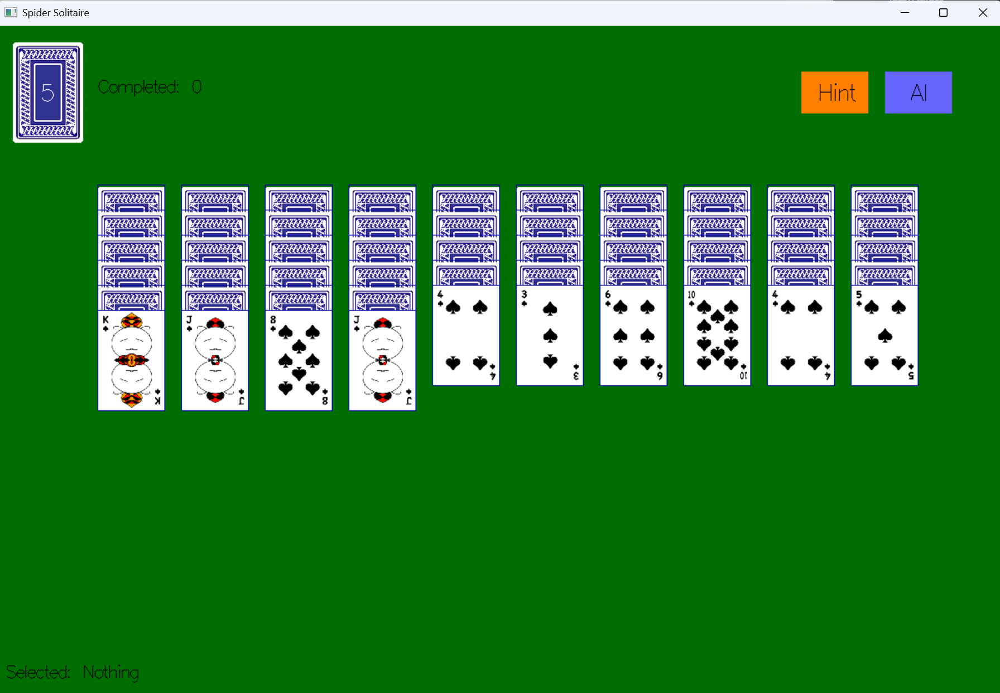

# Spider Solitaire

A desktop implementation of **one-suit Spider Solitaire** written in Haskell with [Gloss](https://hackage.haskell.org/package/gloss). The game includes normal card movement, reserve dealing, automatic foundation completion, a one-step hint, and a heuristic auto-solver.



## Features

- Randomized 104-card, one-suit game with 10 tableau piles
- Five reserve deals of 10 cards each
- Click-to-select and click-to-move controls
- Automatic removal of complete A-to-K runs
- One-step move suggestions
- Heuristic full-game auto-solver
- Win detection after all eight runs are completed

## Requirements

- [GHC 9.4.x](https://www.haskell.org/ghcup/) (the current Cabal file requires `base >= 4.17.2.1 && < 4.18`)
- Cabal
- OpenGL and GLUT

On Windows, the easiest way to install GHC and Cabal is [GHCup](https://www.haskell.org/ghcup/). The repository also includes `app/glut32.dll` for systems that do not already provide GLUT.

## Run the game

Clone the repository and run the following commands from its root directory. Running from the root is required because card images are loaded through relative paths under `resources/`.

```bash
cabal update
cabal run spider-solitaire
```

The first build can take a while because Cabal needs to download and compile the dependencies.

### Windows GLUT troubleshooting

If the program reports that `glut32.dll` is missing, add the repository's `app` directory to `PATH` for the current PowerShell session, then run the game again:

```powershell
$env:PATH = "$PWD\app;$env:PATH"
cabal run spider-solitaire
```

This keeps the bundled DLL inside the project and avoids copying files into `C:\Windows\System32`.

## How to play

Play using the mouse:

1. Click a face-up card to select it. You may also select the start of a complete descending run.
2. Click another pile to move the selected card or run.
3. A run can be placed on an empty pile or on a card exactly one rank higher.
4. Click the face-down reserve deck in the upper-left corner to deal one new card to every tableau pile.
5. A complete face-up run from Ace through King is removed automatically.

An invalid destination cancels the current selection.

### Buttons

- **Hint** immediately performs the move currently rated best by the heuristic.
- **AI** searches for a heuristic solution and, when one is found, immediately applies the entire solution.

The solver only explores moves that improve its state score and deals when no improving move is available. It is designed to be fast, but it is not an exhaustive solver and may fail to solve some winnable deals. Because solving runs on the UI thread, unusually difficult deals may temporarily make the window unresponsive.

## Rules implemented by this version

This project uses a simplified, one-suit ruleset:

- All cards are spades; there are eight copies of each rank.
- A movable run must be face-up and ordered by consecutive rank.
- The game allows a reserve deal whenever reserve cards remain, including when a tableau pile is empty.
- The game is won after eight complete runs have been removed.

## Project structure

```text
app/
  Main.hs          Application entry point
  GUI.hs           Gloss rendering and mouse input
  Action.hs        Game rules, state transitions, hints, and solver
  Definition.hs    Core data types and UI constants
  glut32.dll       Bundled Windows GLUT library
resources/         Card artwork and screenshot
spider-solitaire.cabal
```

## Build notes

The Cabal package currently declares `LICENSE` and `CHANGELOG.md`, but those files are not present in the repository. This does not affect the game logic, but they should be added before creating a source distribution with `cabal sdist`.

## License

The package metadata declares the project as MIT licensed. A corresponding `LICENSE` file still needs to be added to the repository.

